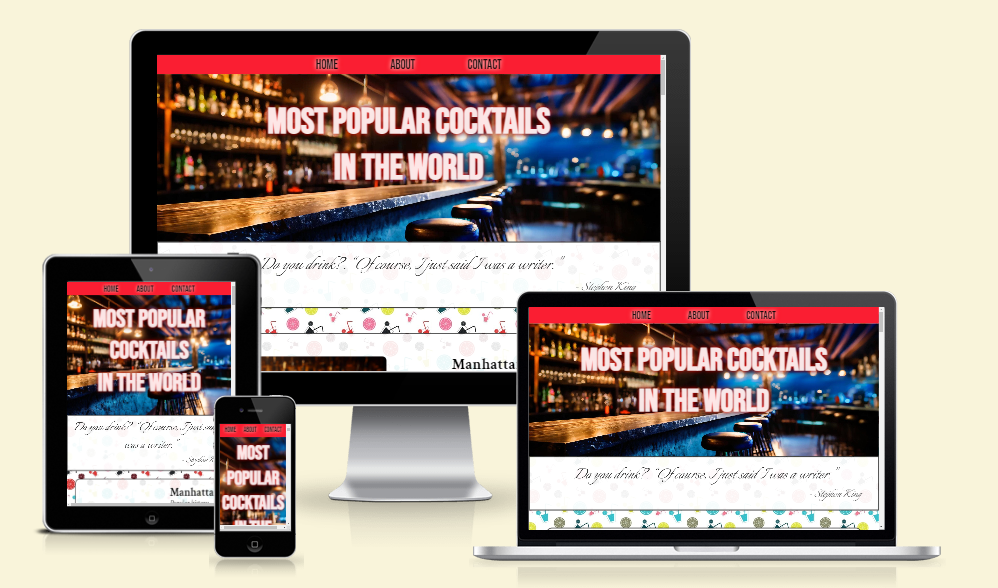
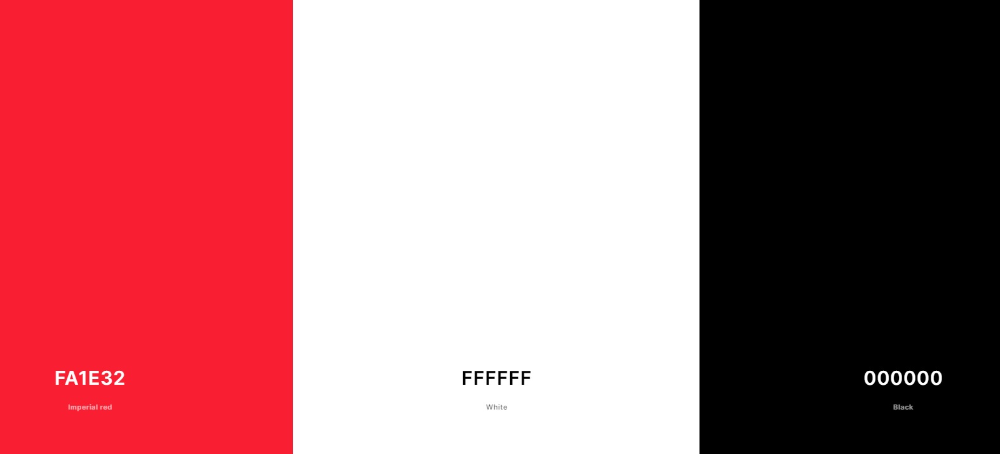

# Cocktails Website

This website project was created to show people cocktail culture and tell popular cocktail recipes.

[View Cocktails site on Github Pages](https://terraeb.github.io/project_1/)

 

## CONTENTS

* [User Experience (UX)](#User-Experience-(UX))
  * [Initial Discussion](#Initial-Discussion)
  * [User Stories](#User-Stories)

* [Design](#Design)
  * [Colour Scheme](#Colour-Scheme)
  * [Typography](#Typography)
  * [Imagery](#Imagery)
  * [Wireframe](#Wireframe)
  * [Features](#Features)
  * [Accessibility](#Accessibility)

* [Technologies Used](#Technologies-Used)
  * [Languages Used](#Languages-Used)
  * [Frameworks, Libraries & Programs Used](#Frameworks,-Libraries-&-Programs-Used)

* [Deployment & Local Development](#Deployment-&-Local-Development)
  * [Deployment](#Deployment)
  * [Local Development](#Local-Development)
    * [How to Fork](#How-to-Fork)
    * [How to Clone](#How-to-Clone)

* [Testing](#Testing)
  * [W3C Validator](#W3C-Validator)
  * [Known Bugs](#Known-Bugs)
  * [Future Features](#Future-Features)
    * [Testing User Stories](#Testing-User-Stories) 
    * [Index Page](#Index-Page) 
    * [Contact Us Page](#Contact-Us-Page) 
  * [Full Testing](#Full-Testing)
  
* [Credits](#Credits) 
  * [Content](#Content)
  * [Media](#Media) 

- - -

## User Experience (UX)

### Initial Discussion

A site with a rating of the most popular cocktails in the world, which describes the history and recipe of all favorite cocktails. Cocktails are always tasty and interesting. 
Whether it's a shot at a party or a long drink for dinner at a restaurant.

#### Key information for the site

* World ranking of cocktails.
* The history of the cocktail.
* Recipe and method for preparing a cocktail.
* Opportunity to share your favorite recipes. 

### User Stories

#### Client Goals

* To be able to view the site on a range of device sizes.
* To easily learn more about popular cocktails.
* So that you can easily repeat the cocktail thanks to the recipe. 

- - -

## Design

### Colour Scheme

The colour palette was created using the [Coolors](https://coolors.co/) website.

### Typography

Google Fonts was used for the following fonts:

* Bebas Neue is used for headings on the site. It is a sans-serif font.

* Crimson Text is used for the body text on the site. It is a serif font.  

* Italianno is used on the quote section. It is a cursive font.

### Imagery

The images were created using artificial intelligence namely: Main picturce "Adobe firefly ([firefly.adobe.com](https://firefly.adobe.com/))", cocktails "Bing Image AI ([www.bing.com/images/create](https://www.bing.com/images/create))".

### Wireframe

Wireframe main page

 
[![Wireframe][1]][1]
 
[1]: ./docs/wireframe.png
 

### Features

The website consists of five pages, three of which are accessible from the navigation menu (home page, about page and contact page). The fourth page is the page that receives the recipe from the user (for now it is replaced by a link to the [Code Institute](https://formdump.codeinstitute.net), which is displayed after the user submits the form to contact us. The fifth page is the page " 404 error", you can get to it from the social network buttons in the footer.

* All pages of the site contain:
  * A responsive navigation bar at the top that allows the user to navigate around the site. In the center of the navigation bar there are links to website pages (home page, about and contacts).
  * A footer containing social media icons, links to Facebook, Instagram, Linkedin, Twitter, Youtube.

* Home Page.
  * Main image with title.
    "The most popular cocktails in the world".
  * Carousel Section.
  The carousel contains quotes from famous people about cocktails and alcohol.
  * Cocktails.
  This is the main section in the home page. It contains photographs, titles, stories and cocktail recipes.

* About Page.
  *  This page is for informational purposes for users only.

* Contact Page.
  * Form
    The form contains fields for the user's first and last name, email address, phone number and a text area in which the user can enter his recipe. The user submits the form using the submit button and also has a "Clear" button to clear the filled data. Users must complete the First and Last Name, Email, Phone Number, and Text area fields to be able to submit the form. If they don't, a tooltip will help them fill in any information they missed.
  * There is also a visual hint when the user has entered the correct data, the field changes from red to green.
  * Input validation: 
    * First and last name (from 2 to 20 characters).
    * Email (using type="email").
    * Phone number (using type="tel". Pattern="[0-9]{10}") is also added to validate user input and the maximum number of characters is limited to 10.
    * Text area for entering a recipe, limited to a minimum of 25 characters.

### Accessibility

I have been mindful during coding to ensure that the website is as accessible friendly as possible. I have achieved this by:

* Using semantic HTML.
* Using descriptive alt attributes on images on the site. 
* Ensuring that there is a sufficient colour contrast throughout the site. 

- - -

## Technologies Used

### Languages Used

HTML and CSS were used to create this website.

### Frameworks, Libraries & Programs Used

Git - For version control.

Visual Studio Code - desktop version IDE.

Github - To save and store the files for the website.

Google Fonts - To import the fonts used on the website.

Font Awesome - For the iconography on the website.

Google Dev Tools - To troubleshoot and test features, solve issues with responsiveness and styling.

[Tiny PNG](https://tinypng.com/) To compress images.

[Favicon.io](https://favicon.io/) To create favicon.

[Am I Responsive?](http://ami.responsivedesign.is/) To show the website image on a range of devices.

- - -

## Deployment & Local Development

### Deployment

Github Pages was used to deploy the live website. The instructions to achieve this are below:

1. Log in (or sign up) to Github.
2. Find the repository for this project, project_1.
3. Click on the Settings link.
4. Click on the Pages link in the left hand side navigation bar.
5. In the Source section, choose main from the drop down select branch menu. Select Root from the drop down select folder menu.
6. Click Save. Your live Github Pages site is now deployed at the URL shown.

### Local Development

#### How to Fork

To fork the project_1 repository:

1. Log in (or sign up) to Github.
2. Go to the repository for this project, TeRRaeB/project_1.
3. Click the Fork button in the top right corner.

#### How to Clone

To clone the project_1 repository:

1. Log in (or sign up) to GitHub.
2. Go to the repository for this project, TeRRaeB/project_1.
3. Click on the code button, select whether you would like to clone with HTTPS, SSH or GitHub CLI and copy the link shown.
4. Open the terminal in your code editor and change the current working directory to the location you want to use for the cloned directory.
5. Type 'git clone' into the terminal and then paste the link you copied in step 3. Press enter.

- - -

## Testing

Testing was ongoing throughout the entire build. I utilised Chrome developer tools while building to pinpoint and troubleshoot any issues as I went along.

During my meeting with the mentor, the following questions were raised:
  * the address of the "contact" form was replaced with code institute.
  * The “recipe” button is highlighted in red and an icon has also been added.
  * Site tested on the service (https://wave.webaim.org/)

Testing report

[![Testing report][2]][2]
 
[2]: ./docs/wave.webaim.png 

 

### W3C Validator

The W3C validator was used to validate the HTML on all pages of the website. It was also used to validate CSS in the style.css file.

  

Index Page HTML

 
[![Index Page HTML][3]][3]
 
[3]: ./docs/testing/w3c_index_page.png

 

About Page HTML

 
[![About Page HTML][4]][4]
 
[4]: ./docs/testing/w3c_about_page.png

 

Contact Page HTML

 
[![Contact Page HTML][5]][5]
 
[5]: ./docs/testing/w3c_contact_page.png

 
 

404 Page HTML

 
[![404 Page HTML][6]][6]
 
[6]: ./docs/testing/w3c_404_page.png

 

 

style.css CSS

 
[![style.css CSS][7]][7]
 
[7]: ./docs/testing/w3c_style_css.png

  

### Known Bugs

* The form of the “contacts” page after sending and validation of the entered data. add recipes.

### Future Features
* I would like to add a back to top button when the user scrolls through the main menu with cocktails. This would be user friendly.

### Full Testing

To fully test my website I performed the following testing using a number of browsers (google chrome).

I also went through each page using google chrome developer tools to ensure that they responsive on all different screen sizes.

Links.

* Test each link. Each link worked as expected. 

Contact Us Form.

* Test the contact us form. I tried to submit the form without filling in any input fields. The form worked correctly and directed users to fill in the name field. I then filled in the name field and tried to submit the form. Again the form worked correctly and directed the user to fill out the email field. I filled out the name and email forms and tried to submit the form. The form worked correctly and asked the user to fill in the textarea field. I filled out the name, email and textarea field and tried to submit the form. The form then opens the Code Institute forms in the same browser window.
* I tried to submit the form with only an email address - the form directs the user to fill in the name field. I filled out the name and email fields and tried to submit the form. The form then directs the user to fill out the textarea field. I filled in the name, email and textarea field and submitted the form. The form then opens the thank you page in the same browser window. 
* I tried to submit the form with only the textarea field filled in. The form directs the user to fill in the name field. I filled in the name and textarea field and submitted the form. The form directs the user to fill in the email field. I filled in the name, email and textarea fields and submitted the form. The form then opens the thank you page in the same browser window. 
* I tried submitting the form without any information filled in. The form directs the user to fill in the name field. It then goes on to ask the user to complete the email and textarea fields if they are not filled out. The form can then be submitted and will open the thank you page in the same browser window.
* I tried to enter incorrect data, it didn’t work, the form validation worked correctly.

- - -

## Credits

### Content

* Website content was taken primarily from Wikipedia.com

### Media 

* All images were created using AI 
 